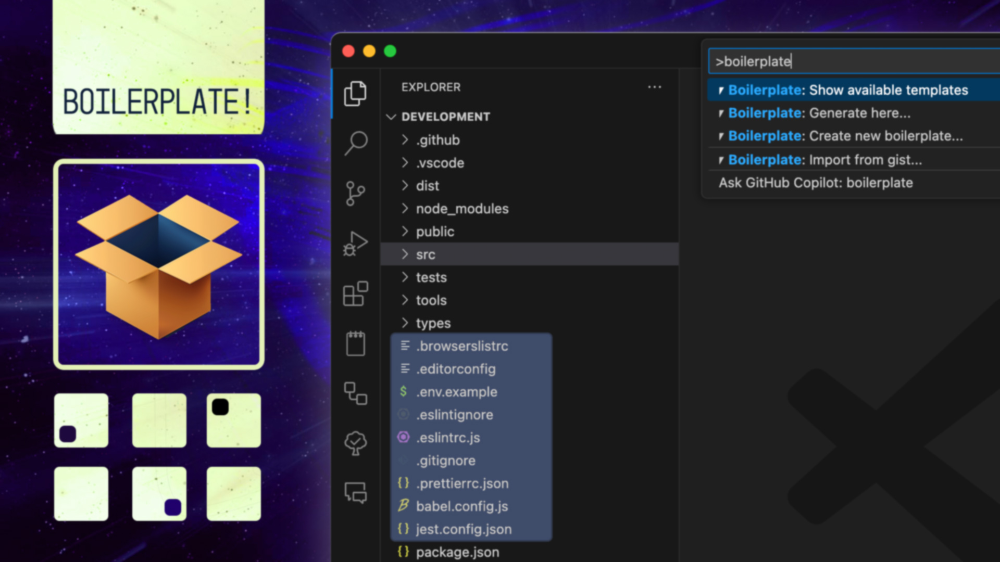
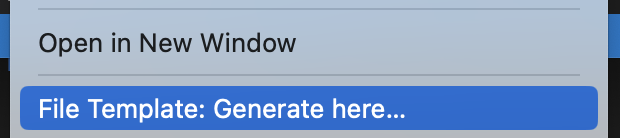

<h3 align="center">
	Streamline your workflow by effortlessly unpacking folders of templates.
</h3>

<p align="center">
	<a href="https://marketplace.visualstudio.com/items?itemName=PolymerMallard.global-boilerplate" title="Visual Studio Marketplace Version"></a>
	<a href="https://marketplace.visualstudio.com/items?itemName=PolymerMallard.global-boilerplate" title="Visual Studio Marketplace Installs"></a>
	<a href="https://paypal.me/polymermallard" title="Backers on Paypal"></a>
</p>

<hr />

## Getting Started

### Create Your First Template

We start by creating a new template in our workspace. You'll be able to put anything in the `src` folder once it's created.

1. Open the Command Palette (_Cmd+Shift+P_ or _Ctrl+Shift+P_)
2. Find `> ⎖ Boilerplate!: Create new boilerplate...`
3. Select `$WORKSPACE/.vscode/templates`
4. Type "My First Template"

> The template includes a `src/example.txt` that displays some available variables and how to use them.

### Import from Gist

If you've found a [public gist](https://gist.github.com/) you'd like to use:

1. Open Command Palette and find `> ⎖ Boilerplate!: Import from gist...`
2. Select the folder you'd like to save it to _(e.g. home vs workspace)_
3. Enter a name for the template
4. Paste the full URL or Gist ID into the prompt

Here's a [sample gist](https://gist.github.com/mattkenefick/6fd1c869b36b6bda5c36bde54d63a8d1) you can try that includes common dot files such as `.gitignore`, `.editorconfig`, etc.

## Usage


You can unpack a template in two ways:

### 1. Using Command Palette

1. Open the Command Palette (_Cmd+Shift+P_ or _Ctrl+Shift+P_)
2. Find `> ⎖ Boilerplate!: Generate here...`
3. Choose a template
4. Fill in required inputs (if any)

### 2. Using Context Menu

1. Right click a folder in the Explorer
2. Select `⎖ Boilerplate!: Generate here...`
3. Choose a template
4. Fill in required inputs (if any)



## Variable System

Files in your templates can use variables, execute code, and apply user input to filenames. There are several ways to use variables.

### Variable Sources

1. Variables defined in your VS Code settings
2. Variables from `process.env`
3. Data from a local `package.json` file (if available)
4. User defined input (asked by the extension)
5. Custom in-template contexts

### Variable Syntax

#### Single Brackets: Basic Placeholders

Basic variable syntax uses single brackets with dollar sign:

```
${variable}
${env.USER}
${package.version}
${input.filename}
```

#### Variable Transformations

Apply transformations to variables using colon syntax:

```
${filename:uppercase}     → MYFILENAME
${filename:lowercase}     → myfilename
${filename:capitalize}    → Myfilename
${filename:camelcase}     → myFilename
${filename:pascalcase}    → MyFilename
${filename:snakecase}     → my_filename
${filename:kebabcase}     → my-filename
```

#### Double Brackets: JavaScript Evaluation

For dynamic JavaScript evaluations:

```
${{ Date.now() }}
${{ variables.env.USER.toUpperCase() }}
```

All variables are available through the `variables` object:

```
// Input
User: ${{ variables.env.USER }}
Modified: ${{ variables.env.USER.toUpperCase() }}

// Output
User: polymermallard
Modified: POLYMERMALLARD
```

More complex examples:

```
${{
	const [major, minor, patch] = variables.package.version.split('.');
	`Major: ${major}\nMinor: ${minor}\nPatch: ${patch}`
}}
```

```
${{
	if (variables.package.author.indexOf('Kenefick') > -1) {
		`It's Matt.`
	}
	else {
		`It's someone else.`
	}
}}
```

#### Triple Brackets: Variable Definition

Define variables for later use:

```
{{{ variables.myVariable = 'This is my variable'.split(' ').join('-') }}}

${{ variables.myVariable }}
```

Output:
```
This-is-my-variable
```

> **Note:** If any evaluated context fails, subsequent contexts will NOT BE PROCESSED, so ensure your code works properly.

### Date Variables

Format dates using the moment.js syntax:

```
${date:YYYY-MM-DD}       → 2025-03-23
${date:HH:mm:ss}         → 14:30:00
${date:YYYY-MM-DD HH:mm} → 2025-03-23 14:30
```

### UUID Generation

Generate unique identifiers:

```
${uuid}        → a1b2c3d4-e5f6-47g8-h9i0-j1k2l3m4n5o6
${uuid:short}  → a1b2c3
```

### Counter Variables

Create numbered sequences:

```
${counter}                           → 1
${counter:start=10}                  → 10
${counter:padding=3}                 → 001
${counter:step=5}                    → 5
${counter:start=100:step=10:padding=4} → 0100
```

### Environment and Git Information

Access system and git repository information:

```
${env:HOME:/default-value}
${git:branch}
${git:repo}
${git:author}
${git:email}
```

### Using Variables in Filenames

Variables can be used in file and folder names by using curly braces:

```
{filename}.js            → mycomponent.js
{filename:pascalcase}.js → MyComponent.js
{date:YYYY-MM-DD}.md     → 2025-03-23.md
```

## Custom Variables

Add custom variables in your VS Code settings:

```json
"global-boilerplate.variables": {
	"${lorem}": "Lorem ipsum sit amet dolor.",
	"${my-variable}": "Hello World."
}
```

These would be accessible in your template via `${lorem}` and `${my-variable}`.

## Template Locations

Specify where the extension searches for templates:

```json
"global-boilerplate.templateDirectories": [
	".vscode/templates",
	"$HOME/VSCodeTemplates"
]
```

Special path variables:

```
~ = process.env.HOME
$HOME = process.env.HOME
$WORKSPACE = workspaceRoot
```

## Release Notes

### 1.2.1
- Boilerplate! renamed and refactored

### 0.2.1
- Modify template to include `src/` by default

### 0.2.0
- Add dynamic filenames
- Improve variables and add ability to set them
- Add examples
- Update README

### 0.1.0
- Initial release