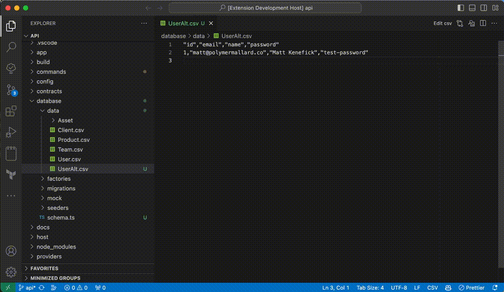
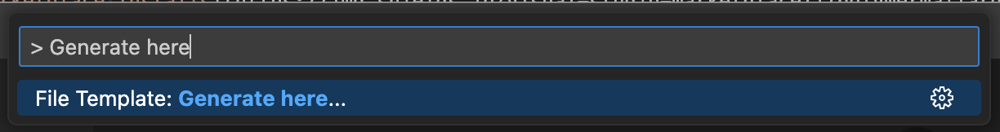

# ⎖ Boilerplate!

[](https://marketplace.visualstudio.com/items?itemName=PolymerMallard.global-boilerplate)
[](https://marketplace.visualstudio.com/items?itemName=PolymerMallard.global-boilerplate)
[](https://paypal.me/polymermallard)

Streamline your development workflow by effortlessly unpacking folders of templates and boilerplates. Customize them with variables to fit any project need.



## 0A. Your first Boilerplate

First, we need to create a template to use.

1. Create a new template pressing _Cmd+Shift+P_ and ">⎖ Boilerplate!: Create new boilerplate..."
2. Select `$WORKSPACE/.vscode/templates`
3. Write "My First Extension" as the name
4. Add new file(s) in this newly opened project

You now have a working sample template.

> The template includes a `src/example.txt` that displays some available variables and how to use them. We explore this further down below in `2. Configuration`.

Open a new project and press _Cmd+Shift+P_ to select ">⎖ Boilerplate!: Generate here..." You should now see the "My First Extension" available in the dropdown. After selecting that, will should see your files appear in the root of your project.

If you'd like to unpack them into a specific folder, you can right click the folder and find ">⎖ Boilerplate!: Generate here..." at the bottom of the menu.

## 0B. Import from Gist

If you've found a public template online you'd like to use, you can do the following:

1. Create a new template pressing _Cmd+Shift+P_ and ">⎖ Boilerplate!: Import from gist..."
2. Select the folder you'd like to save it to (e.g. home vs workspace)
3. Enter a name for the boilerplate
4. Paste the full URL or Gist ID into the prompt

It should fetch and download files from the public gist into the folder/name you've specified.

Here's a sample gist you can try that includes a few dot files such as `.gitignore`, `.editorconfig`, etc.
https://gist.github.com/mattkenefick/6fd1c869b36b6bda5c36bde54d63a8d1

## 1. Usage

1. Right click a file in the tree explorer and select "⎖ Boilerplate!: Generate here..." or using the action bar (_Cmd+Shift+P_)
2. Select template to use
3. Add any required inputs (optional)

<div style="text-align: center">
	
</div>

If you don't use the file Explorer tree (left panel), it will add your template to the root of current folder structure.

## 2. Configuration

The files in your boilerplate can evaluate variables, execute custom code, and apply variables to the filename. There are several types of variables available inside your templates.

1. Variables defined in your Code settings
2. Variables defined in `process.env`
3. A local `package.json` file (if available)
4. User defined input (asked by plugin)
5. Custom in-template contexts

### General usage

You can use variables by including them in a `${myVariable}` structure. Some examples of that might include:

```
${foo}
${env.USER}
${package.version}
```

To use user-defined input variables (as asked by the plugin), you can use like:

```
${input.filename}
```

> **Note:** _We start looking for a `package.json` in the path you've selected and search upwards for the nearest one. This allows you to have multiple projects open in a workspace but still use the most accurate manifest._

### Custom Variables

Hardcoded variables with no special wrappings. You can add these to your User Settings.

```
	"global-boilerplate.variables": {
		"${lorem}": "Lorem ipsum sit amet dolor adipiscing elit et al.",
		"${my-variable}": "Hello World."
	}
```

These would be accessible in your template through `${lorem}` and `${my-variable}`.

### Evaluated Variables

You can include dynamic JavaScript evaluations by using a syntax like this:

```
${{ Date.now() }}
```

It will automatically return the value evaluated without need for a `return` statement. Within this context, all other variables are available through the namespace of `variables`, so an example from above would become:

```
variables.foo
variables.env_USER
variables.package_version
```

The object is flat and all nested objects are namespaced by an underscore.

These variables are accessible through the evaluation, so you could do something like:

```
User: ${{ variables.env_USER }}
Modified: ${{ variables.env_USER.toUpperCase() }}
```

which, for me, renders out:

```
User: polymermallard
Modified: POLYMERMALLARD
```

This can be combined into more complex situations like these:

```
${{
	const [major, minor, patch] = variables.package_version.split('.');

	`Major: ${major}\nMinor: ${minor}\nPatch: ${patch}`
}}
```

and

```
${{
	if (variables.package_author.indexOf('Kenefick') > -1) {
		`It's Matt.`
	}
	else {
		`It's someone else.`
	}
}}
```

### Evaluated Contexts

The evaluated variables are powerful but sometimes you want to reuse them or perform more complex tasks. For that, we have a special syntax where you can set variables.

```
Example:

{{{ variables.myVariable = 'This is my variable'.split(' ').join('-') }}}

${{ variables.myVariable }}
```

The generated output for this is:

```
Example:

This-is-my-variable
```

> If any evaluated context fails, the subsequent contexts will NOT BE PROCESSED so make sure your code works.

## 3. Template Locations

You can specify where the extension searches for templates by defining paths in the Code settings file.

```
	"global-boilerplate.templateDirectories": [
		".vscode/templates",
		"$HOME/VSCodeTemplates"
	]
```

You can use these variables in the path:

```
~ = process.env.HOME
$HOME = process.env.HOME
$WORKSPACE= workspaceRoot
```

### Evaluated Code

You can evaluate code / conditionals within the templates using a special syntax. It's executed through `eval()` in the NodeJS environment.

```
// Print date
${{ Date.now() }}

// Access variables from process.env, package, and anything user defined
// Note that `package.version` becomes `package_version` in this context
${{ variables.package_version }}

// Special path variables (interpreted)
${{ workspaceRoot }}           = /Users/mattkenefick/Sites/Projects/vscode-file-template
${{ inputPathRelative }}       = .vscode/templates/my-first-extension/index.js
${{ outputPathRelative }}      = tmp/index.js
${{ inputDirectory }}          = /Users/mattkenefick/Sites/Projects/vscode-file-template/.vscode/templates/my-first-extension
${{ outputDirectory }}         = /Users/mattkenefick/Sites/Projects/vscode-file-template/tmp
${{ inputDirectoryRelative }}  = .vscode/templates/my-first-extension
${{ outputDirectoryRelative }} = tmp
${{ inputFilename }}           = index.js
${{ outputFilename }}          = index.js

// Performing operations
${{
	const [major, minor, patch] = variables.package_version.split('.');

	`Major: ${major}\nMinor: ${minor}\nPatch: ${patch}`
}}

// Conditionals
${{
	if (variables.package_author.indexOf('Kenefick') > -1) {
		`It's Matt.`
	}
	else {
		`It's someone else.`
	}
}}

// Setting variables (note the syntax change)
${--
	variables.myVariable = 'My Variable'
--}

Value: ${{ variables.myVariable }}
Value Upper: ${{ variables.myVariable.toUpperCase() }}
```

## Creating a template

This extension will search for folders within your `boilerplate.templateDirectories` list. Every extension must have a `manifest.json` file.

```
{
	"name": "My Extension"
}
```

Or if you want to have your files in a subdirectory:

```
{
	"name": "My Extension",
	"rootDir": "src"
}
```

All files (except the manifest) will be copied to the directory you select. Binary files are transferred over without modifiction. ASCII files are evaluated for variables.

By default, the filenames are the same. If you need a dynamic filename(s), you can wrap a variable in brackets like so:

```
{filename}.vue
{filename}-123.vue
```

This will prompt the user to provide a value for `filename`. If they input "Batman", you will get a directory like this:

```
Batman.vue
Batman-123.vue
```

Any variables that are requested of the user will be accessible through an "input" object within the template, for example:

```
<div class="view-${input.filename"></div>

<!-- <div class="view-Batman></div> -->
```

## Release Notes

### 0.2.1

-   Modify template to include `src/` by default

### 0.2.0

-   Add dynamic filenames
-   Improve variables and add ability to set them
-   Add examples
-   Update README

### 0.1.0

-   Initial release
