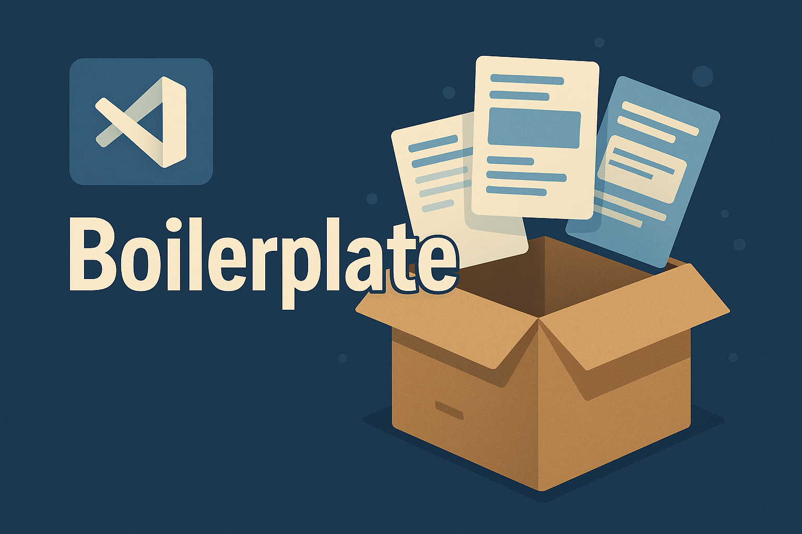
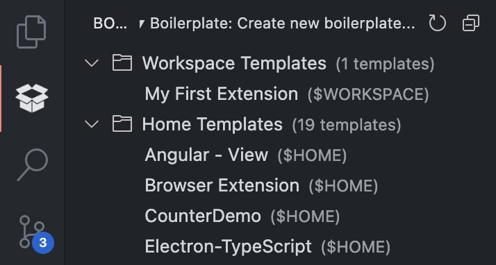
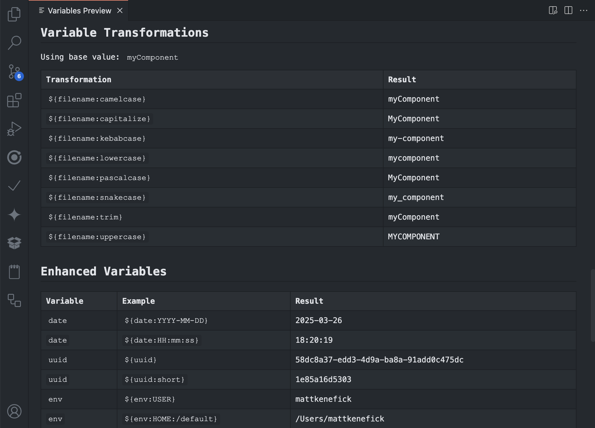

<h1 align="center">
	
</h1>

<h3 align="center">
  Streamline your development workflow with powerful template automation
</h3>

<p align="center">
  <a href="https://marketplace.visualstudio.com/items?itemName=PolymerMallard.global-boilerplate" title="Visual Studio Marketplace Version"></a>
  <a href="https://marketplace.visualstudio.com/items?itemName=PolymerMallard.global-boilerplate" title="Visual Studio Marketplace Installs"></a>
  <a href="https://paypal.me/polymermallard" title="Backers on Paypal"></a>
</p>

## Why Boilerplate!?

**Boilerplate!** eliminates repetitive coding tasks by letting you create and use custom templates with powerful variable substitution.

### Frontend Developers

-   Create components with consistent structure and styling
-   Scaffold new pages with standardized layouts
-   Generate utility files with proper imports and configurations

### Backend Developers

-   Set up API endpoints with consistent error handling
-   Create database models with proper validation
-   Generate service layers with standardized logging

### Project Teams

-   Maintain consistent documentation across projects
-   Establish folder structures that follow team conventions
-   Ensure new files follow naming conventions and patterns

## Key Features

### Template Anywhere

Store and access templates from your workspace or globally across all your projects. Easily share templates with your team or import from GitHub Gists.

### Rich Variable System

The heart of Boilerplate! is its powerful variable system that supports:

-   Basic placeholder substitution
-   Multiple text transformations (camelCase, PascalCase, etc.)
-   JavaScript evaluation for complex logic
-   Custom variable definitions

### Multiple Input Sources

Pull variables from various sources:

-   Environment variables
-   Package.json data
-   VS Code settings
-   User input via prompts
-   Custom template contexts

### Dynamic File Naming

Generate files with intelligent, context-aware names:

-   Use variables in filenames
-   Apply transformations to filename components
-   Include dates, timestamps, and counters

## Features & Tools

### Boilerplate Explorer Sidebar

Access all your templates directly from the VS Code sidebar:

1. Click the Boilerplate! icon in the Activity Bar (left side)
2. Browse through all your template directories
3. Hover over templates to see quick actions:
    - Generate template
    - Edit template
    - Show template info
    - Delete template

The sidebar provides a persistent view of all your templates, making them easily accessible while you work.



### Variable Preview

Visualize all available variables in your current context:

1. Open Command Palette and type `Boilerplate!: Preview Variables`
2. View all variables in a beautiful interactive panel
3. See real-time transformations and examples

The variable preview helps you understand what variables are available and how they'll be transformed, making it easier to create effective templates.



## Getting Started


### Create Your First Template

```
1. Open Command Palette (Cmd+Shift+P / Ctrl+Shift+P)
2. Type "Boilerplate!: Create new boilerplate..."
3. Select "$WORKSPACE/.vscode/templates" location
4. Name your template
```

> The template includes an `example.txt` that demonstrates available variables and usage patterns.

### Using Your Templates

**Via Command Palette:**

```
1. Open Command Palette
2. Type "Boilerplate!: Generate here..."
3. Select your template
4. Fill any required inputs
```

**Via Explorer Context Menu:**

```
1. Right-click on any folder
2. Select "⎖ Boilerplate!: Generate here..."
3. Choose a template
4. Fill any required inputs
```

**Via Explorer Sidebar:**

```
1. Click the Boilerplate! icon in the Activity Bar
2. Find your template in the explorer tree
3. Click the "Generate" icon or right-click and select "Generate..."
4. Choose a destination folder
5. Fill any required inputs
```

## Template Showcase

### Ready-to-Use Examples

| Template Type | GitHub Gist                                                                        | Description                   |
| ------------- | ---------------------------------------------------------------------------------- | ----------------------------- |
| Variable Demo | [View Gist](https://gist.github.com/mattkenefick/8dc93dd47ccc777a5bfd318288a7c570) | See all variables in action   |
| Dev Dotfiles  | [View Gist](https://gist.github.com/mattkenefick/6fd1c869b36b6bda5c36bde54d63a8d1) | Common configuration files    |
| HTML Starter  | [View Gist](https://gist.github.com/mattkenefick/4a872ace38851f6ae28d4048821b4d7a) | Basic HTML project structure  |
| VueX Store    | [View Gist](https://gist.github.com/mattkenefick/f1ea131516c5bff898f6720206de96e7) | Ready-to-use Vue store module |

> **Import any of these templates:**
> Open Command Palette → "Boilerplate!: Import from gist..." → Paste the gist URL

## Variable System

Boilerplate!'s powerful variable system is what makes it truly flexible. Mix and match these variable styles to create dynamic templates.

### Variable Sources

| Source           | Description            | Example                              |
| ---------------- | ---------------------- | ------------------------------------ |
| VS Code Settings | Define in settings     | `${customVar}`                       |
| Environment      | System variables       | `${env.USER}`                        |
| Package.json     | From project config    | `${package.version}`                 |
| User Input       | Prompt on template use | `${input.componentName}`             |
| Custom Context   | Define in template     | `{{{ variables.newVar = 'value' }}}` |

### Variable Syntax Options

#### Basic Variables `${variable}`

Simple placeholder substitution:

```
Author: ${env.USER}
Version: ${package.version}
Component: ${input.filename}
```

#### Transformations `${variable:transform}`

Apply built-in text transformations:

```
${filename}          → mycomponent
${filename:uppercase} → MYCOMPONENT
${filename:lowercase} → mycomponent
${filename:capitalize} → Mycomponent
${filename:camelcase} → myComponent
${filename:pascalcase} → MyComponent
${filename:snakecase} → my_component
${filename:kebabcase} → my-component
```

#### JavaScript Evaluation `${{ code }}`

Execute JavaScript code for dynamic values:

```javascript
${{ Date.now() }}
${{ variables.env.USER.toUpperCase() }}

// Complex example:
${{
  const [major, minor, patch] = variables.package.version.split('.');
  `v${major} (${major}.${minor}.${patch})`
}}
```

#### Variable Definition `{{{ code }}}`

Define variables for later use:

```javascript
{{{ variables.greeting = 'Hello ' + variables.input.name + '!' }}}

// Later in the template:
${{ variables.greeting }}
```

### Special Variable Types

#### Dates

```
Today: ${date:YYYY-MM-DD}       → 2025-03-23
Time: ${date:HH:mm:ss}          → 14:30:00
Timestamp: ${date:YYYY-MM-DD HH:mm} → 2025-03-23 14:30
```

#### UUIDs

```
Full UUID: ${uuid}        → a1b2c3d4-e5f6-47g8-h9i0-j1k2l3m4n5o6
Short UUID: ${uuid:short} → a1b2c3
```

#### Counters

```
Basic: ${counter}                             → 1
Custom start: ${counter:start=10}             → 10
With padding: ${counter:padding=3}            → 001
With step: ${counter:step=5}                  → 5
Combined: ${counter:start=100:step=10:padding=4} → 0100
```

#### Git & Environment

```
Git branch: ${git:branch}
Git repo: ${git:repo}
Git author: ${git:author}
Git email: ${git:email}
Home directory: ${env:HOME:/default-value}
```

### Dynamic Filenames

Use variables in filenames by wrapping them in braces:

```
{filename}.js            → mycomponent.js
{filename:pascalcase}.js → MyComponent.js
{date:YYYY-MM-DD}.md     → 2025-03-23.md
{counter:padding=2}.txt  → 01.txt
```

## Configuration

### Custom Variables

Add your own variables in VS Code settings:

```json
"global-boilerplate.variables": {
  "${company}": "Acme Corporation",
  "${copyright}": "© 2025 Acme Corporation. All rights reserved.",
  "${author}": "Jane Smith"
}
```

### Preview Variables

To help you understand what variables are available and how they can be transformed:

```json
"global-boilerplate.previewConfig": {
  "showTransformations": true,
  "sampleFilename": "myComponent",
  "sampleDescription": "A reusable component"
}
```

### Template Locations

Configure where Boilerplate! finds templates:

```json
"global-boilerplate.templateDirectories": [
  ".vscode/templates",
  "$HOME/VSCodeTemplates",
  "$WORKSPACE/company-templates"
]
```

> **Special paths:** > `~` or `$HOME` = Your home directory
> `$WORKSPACE` = Current workspace root

## Release Notes

### 1.5.2

-   Enhanced variable support
-   New Boilerplate explorer bar
-   Improved Gist support
-   Many variable updates

### 1.2.1

-   Boilerplate! renamed and refactored

### 0.2.1

-   Modify template to include `src/` by default

### 0.2.0

-   Add dynamic filenames
-   Improve variables and add ability to set them
-   Add examples
-   Update README

### 0.1.0

-   Initial release

## Support

Found Boilerplate! useful? [Buy me a coffee](https://paypal.me/polymermallard) to support development!
